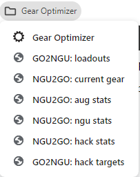

# jshepler.ngu.mods
Collection of mods I wrote for myself.

I had not intended to make these public, as I don't want to support them long-term (i.e. when no longer playing the game). A few people have asked that I share the code, so here you go.

The majority are QoL enhancements. There are a couple bug fixes, and few thigns that are somewhat cheaty-ish but nothing majorly so.

# Installation
These mods are written for [bepinex](https://github.com/BepInEx/BepInEx) v5.4.21, which can be downloaded [here](https://github.com/BepInEx/BepInEx/releases/tag/v5.4.21). Download the x64 version and extract the contents into NGU Idle's game folder `...\Steam\steamapps\common\NGU IDLE`.

Bepinex will set itself up the first time the game is run after extracting the zip. So start the game, then exit the game.

Download the latest jshepler.ngu.mods.dll file from [releases](https://github.com/jshepler/jshepler.ngu.mods/releases) and put it in `...\Steam\steamapps\common\NGU IDLE\BepInEx\plugins`.

# Configuration
The first time the game is run after installing the mods, a configuration file is created: `...\Steam\steamapps\common\NGU IDLE\BepInEx\config\jshepler.ngu.mods.cfg`.

The config file is only read when the game starts, so exit the game before making changes. If an update adds new config options, you will need to start the game for the new options to be added to the file, then exit the game to configure them.

There are only a few config options at the moment. I'll probably add options in the future for the more questionable things.

# GO integration bookmarklets
These are used in the [Gear Optimizer](https://gmiclotte.github.io/gear-optimizer) to talk to NGU. They require you to use GO v0.9.2 or higher - check the [About](https://gmiclotte.github.io/gear-optimizer/#/about/) tab in GO.

Because the data in GO is held on your computer instead of GO's server, NGU can't talk to GO to get/send any data. I also can't inject new controls into GO to talk to NGU. Therefore, need to use bookmarklets to execute javascript in the context of the active browser tab to talk to NGU.

Create a new bookmark. I like using the bookmark bar for easy access and in a sub-folder. You can name them whatever you want. Here's what I named mine:

For the URLs, paste the following javascript:

## sending loadouts from GO to NGU
`javascript:fetch("http://localhost:8088/ngu/go2ngu/loadouts",{method:"POST",body:JSON.stringify(appState.savedequip)});`

This will find matching loadouts in NGU (where loadout name = GO save slot name) and changes the items to match GO. If you have more than one of that item, it will use the one with the highest level.

## sending current equipped items from NGU to GO
`javascript:fetch("http://localhost:8088/ngu/ngu2go/equipped").then(e=>e.json()).then(e=>{let n=appState.savedequip;Object.assign(n.find(e=>"current"==e.name),e),appHandlers.handleSettings("savedequip",n)});`

If you have a save slot named `current` in GO, that will be updated to match your currently equipped gear. If you want to use a different name than `current` in GO, edit the above to specificy a different slot name.

## sending aug stats from NGU to GO
`javascript:fetch("http://localhost:8088/ngu/NGU2GO/augstats").then(t=>t.json()).then(t=>{let s=appState.augstats;Object.assign(s,t),appHandlers.handleSettings("augstats",s)});`

This sends current data from NGU to GO for the `Augments` tab.

## sending ngu stats from NGU to GO
`javascript:fetch("http://localhost:8088/ngu/NGU2GO/ngustats").then(t=>t.json()).then(t=>{let s=appState.ngustats;Object.assign(s,t),appHandlers.handleSettings("ngustats",s)});`

This sends current data from NGU to GO for the `NGUs` tab.

## sending hack stats from NGU to GO
`javascript:fetch("http://localhost:8088/ngu/ngu2go/hacks").then(e=>e.json()).then(e=>{let a=appState.hackstats;a.rpow=e.rpow,a.rcap=e.rcap,a.hackspeed=e.hackspeed;for(let c=0;c<15;c++)a.hacks[c].goal=a.hacks[c].level=e.hacks[c].level,a.hacks[c].reducer=e.hacks[c].reducer;appHandlers.handleSettings("hackstats",a)});`

This sends current hack stats from NGU to GO for the `Hacks` tab.

## sending hack targets from GO to NGU
`javascript:fetch("http://localhost:8088/ngu/go2ngu/hacks",{method:"POST",body:JSON.stringify(appState.hackstats.hacks.map(a=>a.goal))});`

This sends the hack goals from GO to NGU which sets hack targets.

# Twitch Integration

## setup

To setup twitch integration, you will need to [register your app](https://dev.twitch.tv/docs/authentication/register-app/):
- the redirect url MUST be `http://localhost:8088/ngu/twitch/oauth`
- the client type MUST be `Confidential`
- the client id and client secret go into the `jshepler.ngu.mods.cfg` file in the `[Twitch]` section

After setting up custom rewards, you can map them to remote triggers in the cfg file, in the `[Twitch.RewardTriggers]` section. ***The reward names in the cfg file must exactly match, i.e. are case-sensitive.***

In game, right-click the gear (settings) button in the lower-left of the screen to bring up the remote triggers config panel - which now includes twitch options at the bottom. Enabling `Twitch Integration` will add a row to show the connection status and buttons to connect/disconnect and reset.

If configured correctly, click the `Connect` button to connect to twitch and start the authorization process. Your default browser should open a new tab asking your to login to twitch and grant permission to for NGU to connect to your channel.

## troubleshooting
If twitch integration is enabled, the color of the gear icon will change to red if not connected.

If NGU gets disconnected from Twitch, you should just be able to click the `Connect` button to re-connect. If that doesn't work, click the `Reset` button which ditches the current authorization and starts over.

If it continues to stay disconnected, please send me the `...\Steam\steamapps\common\NGU IDLE\BepInEx\LogOutput.log` file. The best way to do this is to DM it to me on discord. I'm on the NGU discord and can be found in the `scripting` or `bug-reports-and-complaints` channels.

# Mods
(in no partiular order)

1. fix basic training when right-click to evenly split assigned energy and no more than needed per offense and defense

2. rebirth resets auto merge/boost timers

3. include auto merge/boost timers when adding offline progression when loading a save

4. displays effective net gold per second under Gold: main screen: TM net - current consumption per second from TM, BM, Augs

5. auto-save on rebirth, challenge, pit throw, changing wandoos OS

6. press F5 to do quicksave, F6 to load latest quicksave

7. the lazy ITOPOD shifter can raise max floor

8. calculates and displays player damage % and boss damage % to determine if current boss can be fought

    (changes Fight Boss button color: green = can nuke, yellow = can win fight)

9. (WIP) displays "total work" at bottom of equipment bonuses: cap * power per E/M/R3

10. during Walderp fight, displays number of remining regular attacks before "walderp says" attack

11. function to reset total time played by pressing RightControl-F1 when on Misc. Stats page

12. displays total blood gain per second under "Blood:" on blood magic page

13. alters tooltips for "Blood Spaghetti" and "Counterfeit Gold" spells to show amount gained when clicked (like Iron Pill does)

14. calculates amount of advanced training needed to autokill titans and displays in the Adventure button's tooltip

15. fixes bug with Target boxes on the advanced training page to allow user to continue changing value when bar completes

16. when doing troll challenge, the Rebirth button's tooltip includes time left before big troll (before big troll is next)

    (and changes Rebirth button's color to red when <= 20 seconds)

17. auto merge/transform unprotected pendants and looties in inventory

18. when in the spend exp menu, on the energy tab:
    - shift-clicking the "Buy ALL Custom" button will buy all custom E/M
    - control-shift-clicking the "Buy ALL Custom" button will buy all custom E/M/R3
    - shift-right-click or control-shift-right-click will repeat buying until not enough EXP

    (just holding those keys down will change the button text to indicate this will happen as well as the total EXP cost)

19. shift-click load button to skip offline time progression when loading a save (open file dialog title indicates when progress will be skipped)

20. appends to adventure zone's tooltip the AT power needed to kill current enemy in 1-5 hits

21. show current quest item drop rate under the quest item drop modifier on the questing screen

22. during manual questing, set questing button color to yellow if the number of quest items in inventory plus the number of quest items already collected are within 5 of the target number (only if got the AP purchase "Quest Reminder!")

23. auto harvest/eat fruits when attain full growth (max tier)

    also on rebirth any fruit >= tier 1

    (auto harvest max tier fruits now have an config option to disable)

24. when starting a manual quest, if current zone has unlocked quest item, that item is assigned as the quest (instead of random quest item)

25. improved bar tooltips, adds:
    - current speed cap: augs, AT, TM, wandoos (all OS at same time), NGUs
    - % of cap allocated: augs, AT, TM, BM, wandoos, NGUs, beards\*
    - over-capped duration (time until no longer over-capped): augs, AT, TM, wandoos, NGUs, beards\*
    - current speed - progress per tick & ticks per bar: augs, AT, TM, wandoos, NGUs, beards
    - time to target: augs, AT, TM, NGUs
    - banked amounts to: AT, TM, beards

    \* I know you don't allocate resources to beards, but the game still calculates progress per tick, which can be used to show a % "allocated" in order to show how much over "cap" the bar is, and to calc/display how long until no longer capped (i.e. how long it will be BB'd) - this helps to project when you won't need beard diggers running to stay BB'd for 24 hour rebirths
        
26. shows current wandoos speed caps for all 3 OS types simultaneously on each bar's tooltip

27. right-click on questing button adds quest items from inventory and completes the quest if target amount met

28. allow target inputs to accept/display scientific and engineering notations, based on number display style in settings

    currently: Advanced Training, NGUs

29. added boss # to displayed "Highest Boss Multiplier" on time machine page (mostly as an exercise of transpiler patch injecting delegate call)

30. added display of digger gps drain diff between current and next level - because the current net gps needs to be enough to cover the diff, not the total

31. toggle auto-allocate resources per bar (shift-click the + button) - idle resources evenly split between enabled bars, disables when hit target

    current bars: Basic Training, Augments, Advanced Training, Time Machine, Blood Magic Rituals, Wandoos, NGUs, Hacks

32. alt-shift-click enables auto-allocate on multiple bars: all ngu energy, all ngu magic, augment+upgrade pair, basic training offense/defense pair (if sync training enabled), TM pair, wandoows pair

33. directly modify loadouts without having to change currently equipped gear:

    right-click loadout item to clear it

    left-click loadout item to enter "selection mode": closes loadout panel, left-click inventory or equipped item to assign it to the slot

    press escape to cancel "selection mode"

34. shift-right-click questing button to toggle automate manual major quest: auto-collect items, auto-complete quest, auto-start new major quest, auto-use butter (option in cfg file)

    doesn't automatically switch adventure zone - assumes already in quest zone and the above mod that uses current zone when starting quest

    when run out of major quests, will start minor idle quest

35. left-alt-click + button to split resources into all runnable bars (i.e. target = 0 or level < target), such that bar speeds are equal

    currently: augment pairs (aug+upgrade), advanced training, NGUs

36. added total boost from recycling to boosts' toolips

37. added boost modifier breakdown to stat breakdowns / misc

38. control-click the + button to calculate and allocate over-cap amount based on target level or target rebirth time (in minutes)

    target: -1 = ignore, 0 = target rebirth time, >0 = target level

    target rebirth time by entering total minutes into the resource input box at top of screen (e.g. to target rebirth time 24:00:00, enter 1440)

    current bars: time machine (both bars), advanced training, augments, NGUs (control-alt-click to do all energy or magic bars)

39. LeftShift-R, LeftShift-T, LeftShift-F removes all of the respective resource from the currently viewed feature (instead of all features)

    currently implemented: basic training, augs, adv training, time machine, blood magic rituals, wandoos, ngu, hacks

40. Upgrade All Diggers by right-clicking the "Gold Digger" button; will upgrade all diggers in order of cost, repeating until not enough gold for any upgrade

41. fruit tooltips show what was last gained (persisted in save)

42. added the current softcaps to infinity cube's power and toughness stats (red means < softcap, green means >= softcap)

    also removed the softcap warnings from the tooltip because it adds clutter for no benefit (for those that already know about cube softcaps)

    added uncapped power and toughness (what's used to determine tier) and amount needed for next tier

43. temp loadout saves currently equipped gear when loading a loadout (regular or temp), load temp loadout by pressing the X key while on inventory screen

    (persisted in save)

44. change daycare bars from "Levels Gained" to show the level the item will be if taken out; if non-macguffin, shows time remaining until level 100. also adds item's current time per level to tooltip

45. fixed bug with basic training's auto advance toggle state not being saved or applied on load

46. test fix (only for energy NGUs) for when calculating how much of cap value to allocate when clicking an NGU's cap button to not clip the cap value to hard-cap

47. when a piece of equipment is maxxed (level 100), automatically enables the item filter for that item (except looties and pendants)

    exceptions: looties, pendants, flubber, wanderer's cane

48. display all fibonacci perk unlocks, green are unlocked, red are locked

49. (WIP) changed how y position of tooltips changes when it would go off the top of the screen to stay up against the top instead of flipping down because some tooltips (e.g. fibonacci perk) would end up going below bottom of screen

50. add tab navigation to various fields, supports shift-tab and wrap-around (tabbing past first/last field, wraps to other end)

    currently: augment targets, advanced training targets, time machine targets, NGUs targets, digger levels, Hacks targets

51. shift-click cap button to get a popup of buttons for the partial caps 10-50%, click to allocate that amount

    (note: these are the amounts for bar fill speeds: 2/3/4/5/6/7/8/9/10 ticks per bar and is what the existing cap buttons allocate)

    currently: blood rituals

52. added tooltip to Money Pit button that shows what the next reward will be as well as the time remaining

53. press control-shift-x to open the hidden krissmuss 2020 event screen

54. unlocked krissmuss 2019 ui theme

55. fixed ygg seeds gained display format bug - not all fruits used current display option (e.g. scientific notation) for number of seeds gained

    patched: all harvested fruits, eaten fruits: FoG, FoPa, FoA

56. replaced hacks' tooltip to include more data related to milestone bonuses and benefits from milestone reducers

57. implemented framework to persist additional data to save file, done in a way that allows such a save to be loadable in vanilla game

    holding shift when clicking the save button will do a clean save (save file dialog's title has "(CLEAN)" appended)

    current data being persisted:
    - auto questing enabled (mod 24)
    - last loadout (mod 43)
    - last ygg rewards (mod 41)
    - last iron pill gain
    - enabled auto-allocators (mod 31)
    - wish queue (mod 67)

58. number keys changes page on: ygg, diggers, beards, hacks, wishes

59. press F11 to toggle fullscreen mode

    (WIP) shift-F11 to toggle maximized window

    (WIP) start work on supporting custom resolutions

60. copy/paste wish allocations: allocate EMR3 to a wish, press control-c to copy, select another wish, press control-v to paste the allocations

61. added right-click costs and levels gained to perk and quirk tooltips

62. added shift-right-click on fib perk to only buy up to next unlock

63. right-click on the enter itopod button to directly enter the tower, skipping the popup

    (if shifter is enabled, will set optimal floor first)

64. (WIP) press control-r to restore all unassigned resources from doing things like pressing R or swapping loadouts and having unassign E/M enabled

    can also press alt-r to take a current "snapshot" to restore later

    [currently disabled - not working quite right]

65. can re-arrange daycare items directly and without resetting timers (i.e. losing progress)

66. (WIP) adds tooltips to the Adv Training, Time Machine, and Beards of Power buttons to show total bank %

    (temp placement, plan to move this info somewhere else)

67. added wish queue
    shift-click a wish to add/remove to/from the queue
    press q to toggle the queue window where can delete a wish, re-order wishes, and clear the queue

68. added number of clicks remaining before button swap on small troll's "click ok 50 times" popup

69. adds "time to max level" to wish tooltips

    hold alt key to see breakdown of times per level

70. the Cap Saved Diggers button uses alternate method
    1. sets saved diggers to level 0
    2. finds saved digger with lowest drain increase for next level that doesn't go over gross gps
    3. increase its level by 1
    4. do again until none found

    (hold alt when clicking to use original method)

71. modified basic training tooltips to be a little cleaner and show more information

    displays the cap after next rebirth as [new]/[min] so know what max reduction will be before getting there

    display at what level max reduction will be reached

    display time remaining before that level

72. clicking the cap button on a basic training skill while having the sync training setting enabled will split evenly between the two skills

73. press B or right-click Fight Boss button to start a boss fight (will nuke if able)

74. on wishes screen, can use arrow keys to move current wish selection

75. press F2 to open a popup to change titans' version without having to go to their zone

76. on an item's tooltip, if there is another of that item in daycare, show the level of the item in daycare including levels gained and displays the total of the 2 items - helpful for looties and pendents to know when to pull daycare item out and merge

77. auto-sniping: skips normal enemies on adventure screen, if < 50% health after boss dies (or if player dies) stays in safe zone until full health

    go to desired zone and press F1 (or right-click idle button) to toggle auto-snipe (changes border of the Idle Mode button to red)

    there's a config option to snipe specified target when in specified zone, instead of that zone's bosses

78. on the rebirth screen, the rebirth button will be red if there is "Crap to do before rebirthing"

79. removed "not less than 10k" limit on buy custom energy/magic cap, lowest is what you can get for 1 exp (e.g. 250 energy cap)

80. fixed bug with Jake's (T3) locusts attack - the attacks aren't supposed to start until the turn after the warning, currently it's the next frame

    (also changed the color of the warning to blue so it's more noticeable)

81. added remote triggers (using HttpListener) that accepts specific requests to trigger functions in game, `http://localhost:8088/ngu/<command>/`

    current commands:
    - autoBoost: executes in-game auto-boost code
    - autoMerge: executes in-game auto-merge code
    - tossGold: executes in-game money pit's "Feed Me"
    - fightBoss: if able to win fight, switches to boss screen, nukes (if able), fight boss (if winable), returns to prev screen
    - kitty: starts troll challenge big troll's kitty event (for fun)
    - totalTimePlayed: generates html to display timer starting from current Total Time Player

    has config options:
    - Enabled: if disabled, ignores commands (except totalTimePlayed)
    - UrlPrefix: what appears before \<command\>, can be used to specify machine name or IP
    - enable/disable individual commands

82. added config file:
    - option to control remote triggers
    - option to enable/disable auto-harvest/eat fruits when fully grown
    - options to control how zone drop table tooltip displays items
    - option to target zone/enemy for auto-sniping
    - option to replace default player portrait with specified boss id

83. separated notifications (aka timed tooltips) from tooltips (doesn't share same window) and made them toasts - allowing multiple notifications

    (ignores boss kills - nuking 50+ bosses generates way too many toasts)

    options to disable this mod or to change orientation (top-down or bottom-up)

84. evenly split resources between selected wishes

    alt-click to select multiple wishes (up to max wish slots)

    alt-click any of the resource + buttons to remove all resources from all wishes, and then split all idle resources to selected wishes

85. improved ITOPOD description (zone tooltip)
    - cleaned up the text
    - added time to next PP/AP/EXP/guff
    - added PP/hour
    - added max and optimal floors

    time to next PP uses 2 calcs: one for when floor \<= optimal floor and another > optimal floor

    \<= optimal floor, 1-shot kills using respawn time + idle attack time

    \> optimal floor, uses rolling average times of last 5 kills

86. adds current zone's drop table as an alternate zone tooltip (hold alt key while hovering mouse over zone description)

    (has options in config file to control when/how some items are displayed)

87. fixed bug with clock zone's drops - it's supposed to have a chance to drop A Busted Copy of Wandoos 98

88. on the start screen, added timestamps to the autosave and steam cloud details

89. when fighting bosses, the Fight Boss button turns red, shows current boss #, and depletes in sync with boss hp

90. tracks total time played per difficulty and displays each on the Misc Stats page

    if installing mod into an existing game that's no longer in normal, there's no way to know how much of the existing playtime is normal, so it assigns all of it to normal

91. modified manual combat moves to be colored based on state:
    - disabled/paralyzed (red)
    - buff running (blue)
    - on cooldown (yellow)
    - on GCD (grey)
    - ready (green)

92. fixed zone dropdown bug that prevented selecting safe zone

93. adds hotkeys to do an merge all (shift-m) and boost all (shift-b)

94. notifications are generated for zones being unlocked

95. right-clicking the Auto Transform buttons on inventory screen will transform all unprotected boosts in inventory

96. show Total Attack/Defense Modifier from augs to the Augments stat breakdown screen

97. display inventory count (used / max) next to the "INVENTORY" label above the inventory grid

98. compare items: while hovering over an item in inventory, press c to lock its tooltip to the top-left of screen, press esc to close it

99. option to change default player portrait to boss portait specified in cfg file

    in `[DefaultPlayerPortait]` section, set `BossId` to the number from the in-game bestiary

100. hold alt when viewing an item's tooltip to see a list of where that item drops

101. highlight currently equipped loadout button on inventory screen

102. options to enable/disable each of the 3 allocators (defaults to disabled)

103. when right-clicking an accessory, it will get equipped in the first open slot

     order follows same order as auto merge/boost, described in [the wiki](https://ngu-idle.fandom.com/wiki/Inventory#AutoMerge_&_AutoBoost)

104. save pruning: when an autosave or quicksave happens, saves older than DaysToKeep (in cfg file) are deleted

     defaults to being disabled, edit cfg file to change DaysToKeep from 0 to something else

105. right-click the `Adventure` button to change to highest zone - same as right-clicking the right-arrow button on the Adventure page

106. right-click the `Loadouts` button to toggle "mark used" - similar to GO's "mark unused", but highlights items that are in any loadout

107. adds support for my [ratio tool](https://jshepler.github.io/) to import base EMR3 directly from NGU

108. GO ([gear optimizer](https://gmiclotte.github.io/gear-optimizer)) integration:
- transfer loadouts from GO to NGU
- transfer current equipped gear from NGU to GO a save slot that's named "current"
- transfer aug stats from NGU to GO's augments tab (ecap, aug speed, net gps, normal LAC, and normal LSC)
- transfer ngu stats from NGU to GO's NGUs tab (em cap, em ngu speed, quirks, blue heart, and current levels for all NGUs)
- transfer hack stats from NGU to GO's hacks tab (rpower, rcap, hack speed, current level and reducer counts for all hacks)
- transfer hack goals from GO's hacks tab to NGU hacks' targets

    **requires adding bookmarklets to your browser - see [GO integration bookmarklets](https://github.com/jshepler/jshepler.ngu.mods?tab=readme-ov-file#go-integration-bookmarklets) above**

109. adds dual-wield effectiveness to the second weaopon slot's item tooltip

110. auto-allocation of mayo generators - hold alt key when on cards screen to change the "CAST", "PROTECT", "YEET" buttons to:
  - OFF: disable auto-allocation of mayo generators
  - LOW: runs 1 or more generators only on lowest mayo amounts
  - ALL: runs all generators in order of lowest to highest mayo amounts

111. options to replace the images for: default player portrait, default daycare kitty, troll kitty

112. right-click on zone forward (right-arrow) button to advance to the zone marked as the "autoadvancer" zone from the "Adventure Advancer" AP purchase

113. adds titan bonus exp kills remaining (from perk 34) to zone drop table tooltip

114. shift-clicking the "-" button to remove a resource from a bar will remove all of the resource, ignoring the "Input" field

115. when using the "buy all custom EMR3" mod, right-click instead of left-click to spend all exp (in multiples of the custom purchase) similar to right-clicking perks and quirks

116. twitch integration to map custom rewards to remote triggers, read [Twitch Integration](https://github.com/jshepler/jshepler.ngu.mods?tab=readme-ov-file#twitch-integration) above for setup

117. cooking helper:
- prefixes ingredient names with pair number to see which ingredients are paired
- suffixes ingredient names with targets (`ingred target`:`pair target`)
- shift-click the `-` button to reset all ingredients to 0
- shift-click the `+` button to set optimal levels to all ingredients to give 100% meal efficiency
